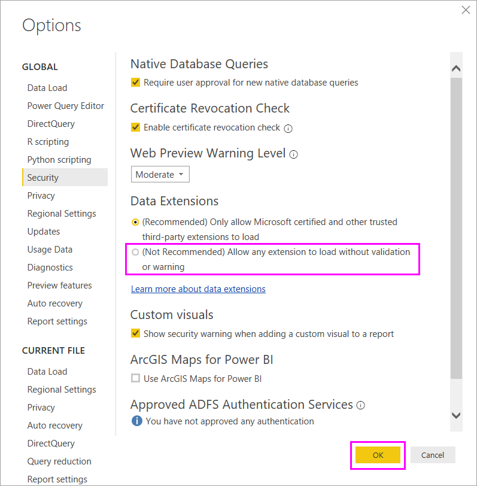

# Powerbi-Doris-Connector

## About

Doris has created a custom Power BI DirectQuery Connector.

## Requirements

*   Microsoft Power BI Desktop
    *   [Download](https://www.microsoft.com/en-us/download/details.aspx?id=58494)

*   MySQL ODBC Driver 5.2
    *   [Download](https://downloads.mysql.com/archives/c-odbc/)

*   Powerbi Doris Connector
    *   [Download](https://github.com/velodb/power-bi-doris/blob/master/Doris.mez)

## Connector extensibility in Power BI

Power BI can connect to data by using existing connectors and generic data sources, like ODBC, OData, OLE DB, Web, CSV, XML, and JSON. Or, developers can enable new data sources with custom data extensions called _custom connectors_. Some custom connectors are certified and distributed by Microsoft as _certified connectors_.

## Custom connectors
Non-certified custom connectors can range from small business-critical APIs to large industry-specific services that Microsoft hasn't released a connector for. Many connectors are distributed by vendors. If you need a specific data connector, contact the vendor.

To use a non-certified custom connector, put the connector _.pq, .pqx, .m, or .mez_ file in the _[Documents]\Power BI Desktop\Custom Connectors_ folder. If the folder doesn't exist, create it.

Adjust the data extension security settings as follows:

In Power BI Desktop, select **File** > **Options and settings** > **Options** > **Security**.

Under **Data Extensions**, select **(Not Recommended) Allow any extension to load without validation or warning**. Select **OK**, and then restart Power BI Desktop.

The default Power BI Desktop data extension security setting is **(Recommended) Only allow Microsoft certified and other trusted third-party extensions to load**. With this setting, if there are non-certified custom connectors on your system, the **Uncertified Connectors** dialog box appears at Power BI Desktop startup, listing the connectors that can't securely load.

To resolve the error, you can either change your **Data Extensions** security setting, or remove the uncertified connectors from your _Custom Connectors_ folder.
